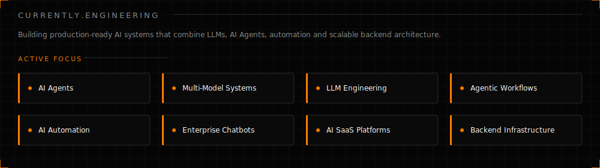
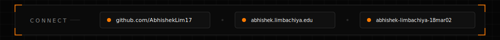

  

 

  

  

## About

I build production AI systems — LLM-powered applications, multi-model routing
architectures, AI agents, and intelligent automation designed to operate at scale.

My engineering work focuses on the layer most teams skip: reliable LLM routing
with provider fallback chains, AI agent orchestration, structured tool calling,
retrieval-augmented generation, and the backend infrastructure required to keep
these systems stable under real-world conditions.

I operate at the intersection of AI engineering and scalable software
architecture — building systems where language models, APIs, and business logic
converge into production-grade software. Not research prototypes. Not demos.
Systems that ship and stay running.

  

  

 

## Currently Engineering

  

## Selected Systems

  

  

 

## Engineering Principles

| | |
|---|---|
| **Reliable over clever** | A boring system that stays up beats a clever one that doesn't. |
| **Architecture before features** | Decide how components talk to each other before deciding what they do. |
| **Automation first** | If I do it twice by hand, the third time is scripted. |
| **Design for maintainability** | Code is read far more often than it's written — optimize for that. |
| **Measure before optimizing** | No tuning without a number to tune against. |
| **Production > prototype** | A demo proves an idea works. A production system proves it keeps working. |

  

  

 

## Technology Ecosystem

  

  

 

## GitHub Analytics

  
  

 

  

  

  

## Connect

  

&nbsp;

[`GitHub`](https://github.com/AbhishekLim17) &nbsp;·&nbsp; [`Email`](mailto:abhishek.limbachiya.edu@gmail.com) &nbsp;·&nbsp; [`LinkedIn`](https://www.linkedin.com/in/abhishek-limbachiya-18mar02/)

 

  

  

