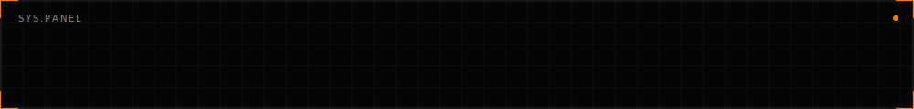
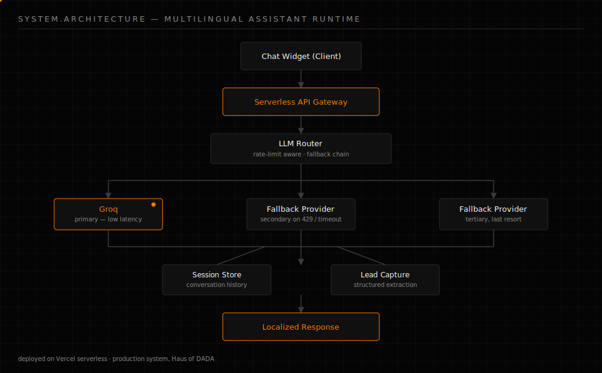

<div align="center">
  
</div>

<br/>

<div align="center">

```
AI SYSTEM STATUS ─────────────────────────────────────────

  IDENTITY      Founder · AI Engineer
  STATUS        Building production AI systems
  FOCUS         LLM routing · AI agents · automation · backend infra
  AVAILABILITY  Open to freelance & collaboration

──────────────────────────────────────────────────────────
```

</div>

<br/>

## About

I design and build AI systems that ship, not notebooks that only demo well once.

My work sits at the intersection of LLM infrastructure and practical
software engineering: routing requests across multiple model providers,
handling rate limits and fallbacks gracefully, and wiring that into backend
systems that businesses actually run in production.

I operate as an independent AI/IT consultant under the **ThinkBridge** brand,
working with small businesses, startups, and international clients on AI
chatbot systems, automation, and full-stack delivery. I’m also deepening this
work through a Master's program in Artificial Intelligence, which feeds back
into how I approach routing strategy, evaluation, and system reliability.

I’d rather maintain one system that works than demo ten that don’t.

<br/>

<div align="center">
  
</div>

## Currently Building



**Haus of DADA** — a multilingual AI chatbot widget in production for a
German digital agency (`hausofdada.de`). It handles LLM routing across
providers, conversation/session storage, and structured lead capture, built
in vanilla JS for a lightweight embeddable footprint.

**Magnetar Global** — a full site redesign coordinated through a two-model AI
workflow: architectural and QA decisions handled deliberately, bulk
HTML/content generation handled separately, and both kept in sync through a
persistent instruction system that survives tooling and account changes.

**Research direction** — narrowing in on cost-aware LLM routing, model
hallucination fingerprinting, and bias auditing for AI-driven screening
tools as part of ongoing Master's research.

<br/>

## Engineering Principles

| | |
|---|---|
| **Reliable over clever** | A boring system that stays up beats a clever one that doesn't. |
| **Architecture before features** | Decide how components talk to each other before deciding what they do. |
| **Automation first** | If I do it twice by hand, the third time is scripted. |
| **Design for maintainability** | Code is read far more often than it's written — optimize for that. |
| **Measure before optimizing** | No tuning without a number to tune against. |
| **Production > prototype** | A demo proves an idea works. A production system proves it keeps working. |

<br/>

<div align="center">
  
</div>

## System Architecture

A simplified view of the routing and fallback architecture behind the
Haus of DADA chatbot — the production pattern I default to for
LLM-backed systems that need to stay online under rate limits.

<div align="center">
  
</div>

<br/>

## Technology Ecosystem

**AI / LLM**
`Groq` `OpenAI API` `Gemini API` `Prompt Engineering` `LLM Routing & Fallback Chains` `Multi-Model Orchestration`

**Backend**
`Node.js` `Python` `REST APIs` `Serverless Functions`

**Frontend**
`JavaScript` `React` `Next.js` `Vanilla JS (embeddable widgets)`

**Infrastructure & Deployment**
`Vercel` `Git` `GitHub Actions` `Custom Domains`

**Data & Storage**
`Supabase` `PostgreSQL` `Session / Conversation Storage`

**Tooling**
`VS Code` `Postman` `Linux`

<br/>

<div align="center">
  
</div>

## GitHub Analytics

<div align="center">
  
  
</div>

<br/>

## Connect

<div align="center">

[GitHub](https://github.com/AbhishekLim17)
&nbsp;·&nbsp;
[Email](mailto:your-email@example.com)
&nbsp;·&nbsp;
[LinkedIn](https://www.linkedin.com/in/your-linkedin-handle)

</div>

<br/>

<div align="center">
  
</div>
