<!-- Generated by tools/build.mjs — edit that file and re-run `node tools/build.mjs`, not this one. -->

  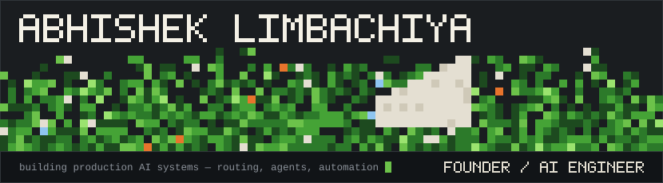

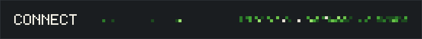

  <a href="https://www.linkedin.com/in/abhishek-limbachiya-18mar02/">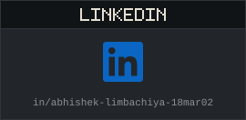</a>
  <a href="mailto:abhishek.limbachiya.edu@gmail.com">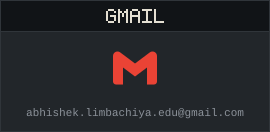</a>
  <a href="https://github.com/AbhishekLim17">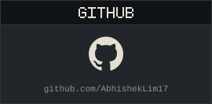</a>

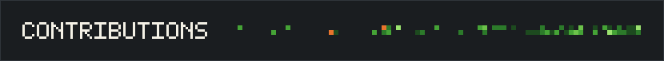

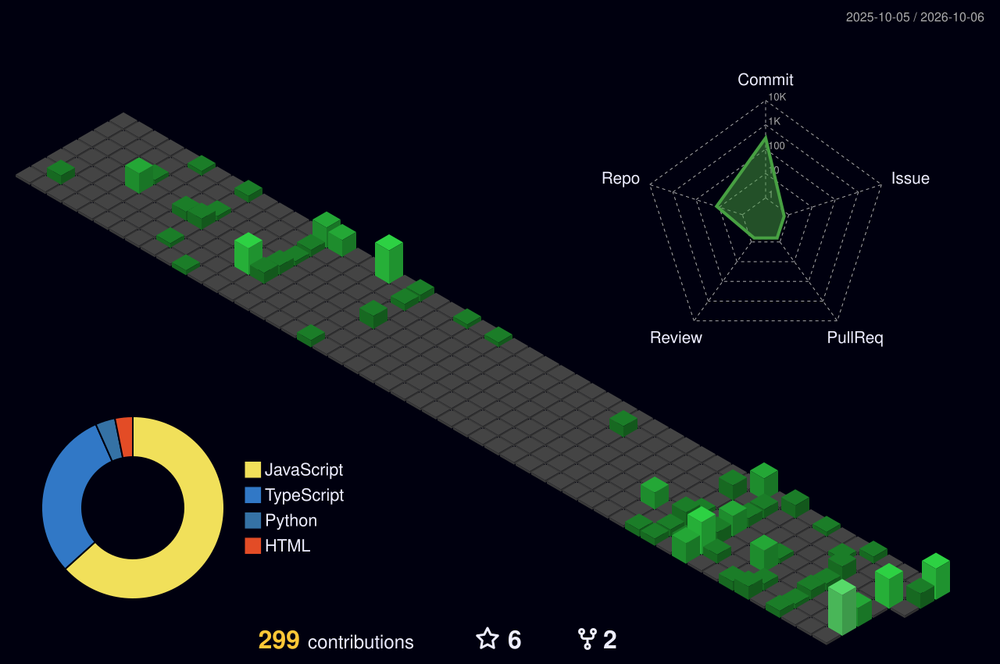

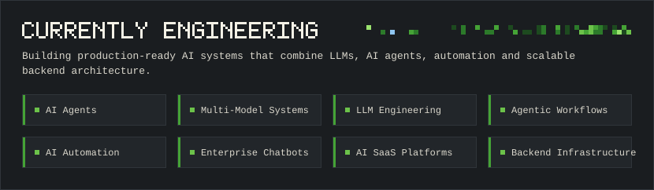

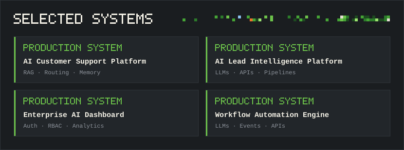

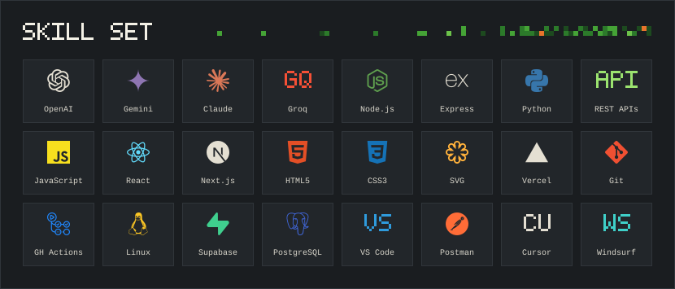

  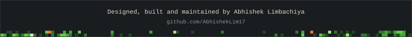
  

